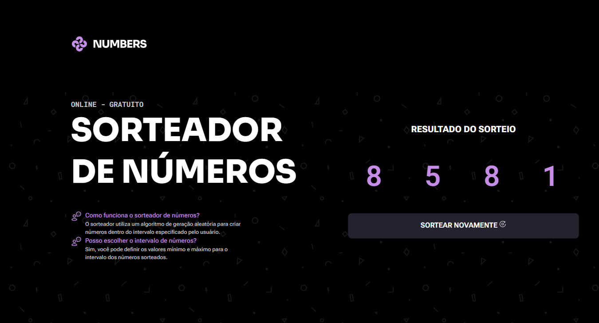

# 🎰 Numbers Sorter

Uma aplicação com a interface moderna e animada que traz a possibilidade de sortear até dez números de uma só vez, podendo repetir os mesmos entre si ou não. A aplicação é mais um dos desafios práticos da Rocketseat onde utilizei diversas áreas do Javascript.

## 📑 Índice

- [Tecnologias Utilizadas](#️-tecnologias-utilizadas)
- [UI](#-ui)
- [Funcionalidades](#️-funcionalidades)
- [Como Rodar o Projeto](#️-como-rodar-o-projeto)
- [Agradecimentos](#️-agradecimentos)

## 🛠️ Tecnologias Utilizadas

### 🔎 Front-end

- **HTML/CSS** - Design do site e responsividade
- **JavaScript** - Funções e estilização mais avançadas

  

## 📷 UI

## ⚙️ Funcionalidades

- Sorteia números do 1 até 999
- Possibilidade dos números se repetir
- Sorteia até 10 números de uma só vez
- Atende à maioria dos dispostivos

## 🚀 Como Rodar o Projeto

- 🔗 Link - [Numbers](https://jefolidev.github.io/numbers-sorter/)

## 👥 Fale comigo!

Achou meu repertório interessante e gostaria de contratar um freela ou talvez me contratar para tornar acrescenter no seu negócio? Entre em contato comigo e vamos marcar.

  
  

